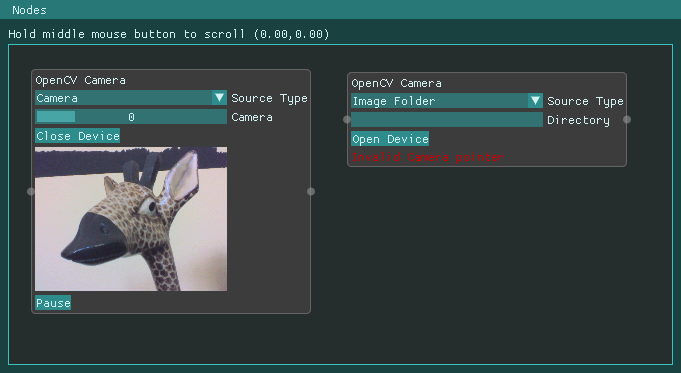

# HellBender VisionGraphEditor

Editor to edit vision graphs for HellBender.

## Dependencies
* HellBender
* OpenCV
* CMake
* Git

## Building

* get and build [HellBender](https://github.com/wose/HellBender)
* supply cmake with the path to the HellBender libs and includes
  ``-DHELLBENDER_LIB_DIR=../HellBender/build/lib``
  ``-DHELLBENDER_INCLUDE_DIR=../Hellbender/build/include/hb``
* clone, build and run
  ```shell
  % git clone https://github.com/wose/HBVisionGraphEditor.git
  % cd HBVisionGraphEditor
  % mkdir build && cd build
  % cmake -DCMAKE_BUILD_TYPE=Debug -DCMAKE_EXPORT_COMPILE_COMMANDS=1 ..
  % make
  % cd bin && ./hbvisiongrapheditor
  ```

## Screenshot

